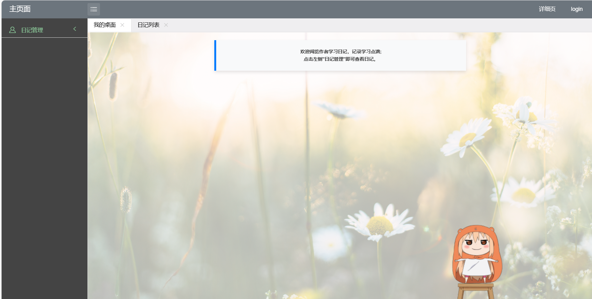

# 素笺拾光

#### 介绍
“素笺” 寓意空白的纸张，承载着每日心情，“拾光” 则有拾取时光碎片、留存记忆之意，
象征着通过日记捕捉生活中的点滴光芒，此项作品能通过网页记录个人收获所得。

#### 软件架构
软件架构说明：
《素笺拾光》基于 Beego 框架构建单体架构，涵盖前端、后端、数据、基础设施与安全多层。前端用 HTML5、CSS3、JavaScript 结合相关库打造界面、处理交互，实现流畅操作体验；后端以 Beego 为核心，含路由、中间件，处理业务逻辑，对接数据库（MySQL 存结构化、MongoDB 放半结构化及多媒体元数据）；数据层借助云计算存储服务存多媒体，搭配数据库备份策略；基础设施层利用云服务器实例部署，配 Nginx 优化访问、搭建网络架构与负载均衡；安全层涵盖身份验证、授权与数据加密，保障用户与数据安全，整体为应用稳定高效运行、满足多元需求提供支撑。 

#### 安装教程

1.  安装go语言
2.  go env -w GOPROXY=https://goproxy.cn,direct
3.  go env -w GO111MODULE=on
4.  安装bee工具go install github.com/beego/bee/v2@latest
5.  进入项目执行go mod tidy安装完整依赖

#### 使用说明

1.  在Db里面修改mysql数据库的用户名密码为自己的
2.  bee run启动项目
3.  浏览器输入localhost即可访问页面

#### 部分截图

