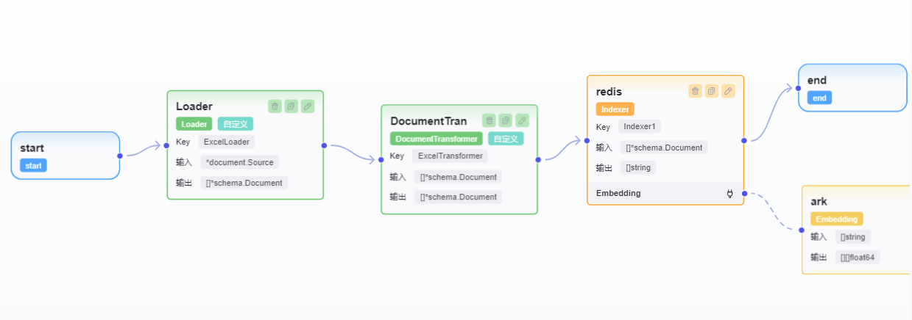

# Eino 智能体开发与部署指南

## 项目简介
本项目基于 Eino 框架和 Eino Dev 工具，集成多种组件，实现智能体的知识库构建、检索、工具调用与前端交互，支持 Excel/Markdown 文件向量化、Redis 存储、MCP 工具集成等。

---

## 目录结构
- `cmd/einoagent/`：主入口，包含服务启动与前端页面，服务的最终关闭处
- `locationKnowledge/`：知识库相关（索引、转换、加载等）
- `localAgent/`：智能体核心逻辑与工具流
- `data/`：内存数据的持久化
- `log/`：工具调用情况的日志记录
- `pkg/`：通用工具包（env、redis、mcp_tools、mem等）
- `image/`：架构与流程图

---

## 组件与架构说明

### 1. 知识库配置与生成
- 支持 Excel/Markdown 文件自动向量化并存入 Redis。
- 通过自定义 Transformer 实现多格式知识文件的向量化转换。
- 主要流程：
  1. 遍历指定目录下的 `.md`/`.xlsx` 文件
  2. 解析内容，转换为向量
  3. 存入 Redis，建立向量索引

#### 关键代码片段
- **Excel 文件向量化转换（transform.go）**
```
func (impl *DocumentTransformerImpl) Transform(ctx context.Context, src []*schema.Document, opts ...document.TransformerOption) ([]*schema.Document, error) {
    var ret []*schema.Document
    for _, doc := range src {
        docs, err := impl.processExcelDocument(doc)
        if err != nil {
            return nil, err
        }
        ret = append(ret, docs...)
    }
    return ret, nil
}
```
- **Redis 索引初始化（pkg/redis/redis.go）**
```
func InitRedisIndex(ctx context.Context, config *Config) error {
    // ...
    createIndexArgs := []interface{}{
        "FT.CREATE", indexName,
        "ON", "HASH",
        "PREFIX", "1", PrefixRedis,
        "SCHEMA",
        ContentField, "TEXT",
        MetadataField, "TEXT",
        VectorField, "VECTOR", "FLAT",
        "6",
        "TYPE", "FLOAT32",
        "DIM", config.Dimension,
        "DISTANCE_METRIC", "COSINE",
    }
    // ...
}
```

### 2. 智能体核心与工具流
- 支持官方 DuckDuckGo 工具、MCP 工具集成。
- 工具流通过 `flow.go` 实现基本的 ReAct 流程，自动整合官方与自定义工具。
- `orchestration.go` 负责整体流程编排。
- `retriever.go` 复用 Redis 检索逻辑。

#### 关键代码片段
- **工具流集成（tools_node.go）**
  - 仅保留 MCP SSE 客户端与 DuckDuckGo 工具，官方自定义工具模板可忽略。
- **检索器初始化（retriever.go）**
```
func newRetriever(ctx context.Context) (rtr retriever.Retriever, err error) {
    // ...
    config := &redis.RetrieverConfig{
        // ...
        ReturnFields: []string{redispkg.ContentField, redispkg.MetadataField, redispkg.DistanceField},
        TopK: 8,
        VectorField: redispkg.VectorField,
        // ...
    }
    // ...
}
```

### 3. 服务启动与前端交互
- 入口在 `cmd/einoagent/main.go`，同时启动 MCP SSE Server 与 Hertz Web 服务。
- 支持优雅关闭，日志中间件，环境变量校验。
- 前端页面通过 `/agent` 路由访问。

#### 关键代码片段
```
func main() {
    ctx, cancel := context.WithCancel(context.Background())
    defer cancel()
    // 启动 MCP 服务器与 Hertz Web 服务
    // ...
    // 注册 agent 路由组
    agentGroup := h.Group("/agent")
    if err := agent.BindRoutes(agentGroup); err != nil {
        log.Fatal("failed to bind agent routes:", err)
    }
    // ...
}
```

---

## 环境变量说明
- `REDIS_ADDR`：Redis 服务地址
- `ARK_API_KEY`、`ARK_EMBEDDING_MODEL`、`ARK_CHAT_MODEL`：API 及模型配置
- `KNOWLEDGE_BASE_PATH`：知识库文件目录
- `HERTZ_SERVER_PORT`：Web 服务端口（默认 8080）
- 其它可选：`APMPLUS_APP_KEY`、`EINO_DEBUG` 等

---

## 快速上手
1. 配置环境变量（参考上文）
2. 启动 Redis 服务
3. 运行知识库生成程序（见 `locationKnowledge/knowledgeIndexing/main.go`）
4. 启动主服务：
```bash
# 设置环境变量后
# go run cmd/einoagent/main.go
```
5. 访问前端页面：`http://localhost:8080/agent`

---

## 参考架构与流程图
### 系统架构所需组件

### 知识库配置流程与工具流

### 知识库UI配置，采用自定义转换

### 整体智能体配置

### UI工具流配置


---

## 常见问题
- **Redis 连接失败**：检查 `REDIS_ADDR` 配置与服务状态
- **知识库未生成**：确认知识文件目录、格式及环境变量
- **工具调用异常**：检查 MCP 服务与工具注册情况

---

## 其它说明
- 代码结构已高度模块化，便于二次开发与扩展
- 详细技术细节请参考各模块源码及注释
